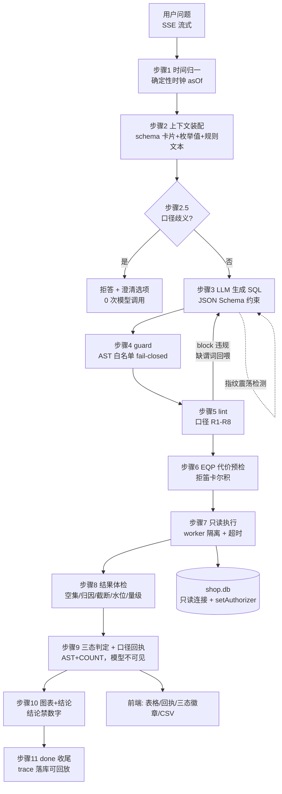

# GateSQL

> 一个会对错口径说「不」的中文取数 agent。

用自然语言问数，GateSQL 生成并只读执行 SQL —— 并在数字交付给你之前，用**代码强制的口径规则**和**结果体检**拦下「SQL 跑通了、图也画了、但数字是错的」那一整类错误。

https://github.com/user-attachments/assets/31dfdd5f-2f5d-4f02-890e-9357e8741b13

*30 秒演示：已核验数字与口径回执 → 口径歧义拒答与一键澄清 → 空结果归因（详见 [演示脚本](docs/demo-script.md)）*

---

## 为什么需要它

不会写 SQL 不是真问题 —— 那件事 ChatGPT 就能做。Text-to-SQL 在真实业务里唯一的硬障碍是：**它错得很安静。**

在本项目自带的示例库上，三个陷阱都是现成的：

| 问题 | 错误写法得到 | 正确答案 | 偏差 |
|---|---|---|---|
| 总销售额（漏 `status='已完成'`） | 60,765,700.25 | 41,015,358.75 | 高估 48% |
| 客单价（JOIN 扇出） | 2,698.56 | 5,057.38 | 低估 47% |
| 销售额（用标准售价而非成交价） | 43,560,642.14 | 41,015,358.75 | **仅 6.2%** |

第三行是这个产品存在的理由 —— **一个只偏 6.2% 的数字，没有任何业务人员能发现**，然后它进入周报、进入决策。

GateSQL 把全部工程量押在一件事上：**一个看起来对的数字，凭什么被相信。**

## 核心能力

- **口径规则引擎** —— 8 条业务口径以 SQL AST 谓词到达性检查在执行前强制生效。违规不是挂个警告，而是带着「缺失的具体谓词」回喂模型重新生成，实现对**业务错误**（而非仅语法错误）的自愈
- **三态输出** —— 已核验 / 未核验（写明原因）/ 拒答（给澄清选项）。拒答基于四类确定性信号，与「模型说不知道」是两回事
- **口径回执卡片** —— 由 AST 和规则表机械生成、**完全不经过模型**，因而结构上不可能撒谎
- **可复现的评测** —— 30 题分层冻结集（写代码前定稿并打 tag），LLM 请求录制回放，CI 里掉点直接让 PR 变红
- **SQL 安全九层纵深** —— 核心是 `setAuthorizer` 引擎级授权回调，拿到的是 SQLite 解析后的语义，注释拆词 / 大小写混写 / 全角字符 / CTE 藏写操作一概失效
- **手写 agent 主循环** —— 多维预算 + AST 指纹环路检测 + 失败六分类，不用任何 agent 框架
- **多轮澄清** —— 口径歧义拒答时给出候选口径，点选后自动带口径重问（确定性词典实现，模型不参与决策）
- **报表固化与 CSV 导出** —— 已核验的 SQL 一键固化为零成本报表；结果导出带 UTF-8 BOM 的 CSV（GBK 机器 Excel 直接打开不乱码），含公式注入防护

## 工作原理



单一进程、双 SQLite 库：`shop.db`（业务数据，agent 只读 + 引擎级授权）与 `app.db`（trace / 报表 / 评测，物理隔离，agent 根本看不见）。完整设计见 [架构设计](docs/02-architecture.md) 与 [Agent 设计](docs/05-agent-design.md)。

## 快速开始

**无 key 一键启动**（自动进入回放模式，预置 10 题可完整体验）：

```bash
git clone https://github.com/liuyuan20000507/gatesql.git
cd gatesql
docker compose up
```

浏览器打开 `http://localhost:3000`。国内网络首次构建实测：

| 场景 | 冷启动耗时 |
|---|---|
| npm 官方源 | 1070s（18 min）—— 容器内直连 npmjs 慢，**不走宿主代理** |
| `NPM_REGISTRY=https://registry.npmmirror.com docker compose up --build` | **577s（9.6 min）** |
| 有构建缓存后再次启动 | **281s（4.7 min）** ✅ |

瓶颈是拉基础镜像与 npm 下载（纯网络带宽），非工程问题；海外/快速网络预计 5 分钟内。

**本地开发**：

```bash
pnpm install
python scripts/seed_db.py        # 生成示例数据库（固定种子，数据可复现）
cp .env.example .env.local       # 填入模型 key（可选——无 key 也能完整演示）
pnpm dev
```

## 评测结果

30 题六层冻结评测集（题面在写任何 agent 代码之前定稿并打 tag `evalset-frozen-v1`），模型答案录制回放保证可复现。评分只看执行结果与 gold 的等价性，不比 SQL 文本。

| 轮次 | 改动 | 总准确率 | 自信错答率 |
|---|---|---|---|
| 基线（原评分口径） | — | 76.7% | 16.7% |
| 基线（校准评分口径） | 评分器列投影/行序修正（7 道错题逐题查 trace 归因） | 93.3% | 6.7% |
| + 输出契约 | 提示词注入格式约束（别名/列/排序纪律） | 96.7% | 0% |
| **+ 澄清机制（最终）** | 口径歧义题确定性拒答 + 澄清选项 | **100%（30/30）** | **0%** |

- **规则误报率 0%**（50 条「结果正确」的 SQL 全量过 lint，任何 block 规则零误报）
- **拒答率 0%**（硬上限 12%）
- 完整曲线、逐题归因与每轮 A/B 数据见 [评测日志](docs/eval-log.md)；CI 门禁在 replay 模式下持续验证（当前基线 96.7%，唯一失分项为比对器的已知转置局限，详见 eval-log）

## 明确不做

这份清单和能力清单同等重要。完整版（36 条）见 [需求与验收](docs/01-requirements.md#五明确不做)，摘要：

通用 BI · 连接用户自己的数据库 · 多轮追问与指代消解 · 向量检索 · 完整语义层（IR + SQL 编译器）· 任何 agent 框架 · 多 agent 编排 · 治理与协作层 · OpenTelemetry · Kubernetes · 移动端与深色模式

每一条都有具体理由 —— 大部分是「工作量以周计而面试零加分」，少数是「它会摧毁评测体系」。

## 踩坑记录

每条格式：现象 → 根因 → 修法。全部来自本项目真实开发过程。

1. **`prepare()` 静默丢弃多语句** —— `prepare("SELECT 1; DROP TABLE x")` 不报错、只执行第一句。→ guard 层把「解析结果是数组」判为多语句直接拒绝；全局禁用 `db.exec()`（扫源码断言测试守着）
2. **`worker.terminate()` 无法回收卡死线程** —— 卡在同步原生调用里的 worker，terminate 永不 resolve，连 `process.exit` 都失效。→ 超时后「放弃等待 + 标记污染 + 下次换新 worker」，旧 worker `unref()` 防绑架进程
3. **React StrictMode 导致 SSE 双连接** —— dev 下 effect 双执行，LLM 付两次费。→ `AbortController` + ref 哨兵
4. **失效的国内 Docker 镜像源** —— USTC/163/百度三源全部 EOF，build/pull 全挂。→ 删除 registry-mirrors 配置
5. **pnpm `allowBuilds` 占位符** —— `approve-builds` 生成的模板一直没填完，本机 node_modules 已存在故从未暴露，Docker 从零安装时 `ERR_PNPM_IGNORED_BUILDS` 炸出 → 补全布尔值。「本机好好的，别人跑就死」的标准案例
6. **Next 构建期预渲染炸库** —— `/reports` 页在 `next build` 预渲染阶段读 app.db，容器构建时数据库不存在 → `force-dynamic` 声明按需渲染
7. **CI fresh clone 缺生成类型** —— `LayoutProps/PageProps` 等类型由 build 生成且被 gitignore，CI 上纯 `tsc --noEmit` 必挂 → 改用 `next build`（先生成类型再做类型检查，一步双用）
8. **PowerShell 5.1 中文 body 按 GBK 编码** —— 测试脚本 POST 的中文变成一串 `?`，服务器侧记录的 question 全是乱码 → 显式 `[Text.Encoding]::UTF8.GetBytes()`
9. **容器网络不走宿主代理** —— 宿主 Clash 对 Docker 容器/构建容器内的网络无效，npm 直连慢 5 倍 → 构建参数 `NPM_REGISTRY` 开关 + 存活加速源
10. **词典误伤评测题** —— 新增歧义词条把评测题 C3/D5 拦下拒答（关键词命中但题面自带口径说明）→ disambiguators 按评测题面实测放宽；词条变更必须跑全量 replay 评测

## 已实现 / 待实现 / 明确不做

**已实现**（全部有测试与评测数据背书）：口径规则引擎（8 条，误报率 0%）· 三态输出 · 口径回执卡（模型不可见）· 多轮澄清 · 安全九层 · 30 题评测体系 + CI 门禁 · Docker 单容器 + 无 key 演示 · 预算护栏 · CSV 导出 · 全链路 trace 回放 · 报表固化与纠正样本回流

**设计完成，待实现**：token 计价（预算护栏已就位，落地即覆盖部分超支）· 结果缓存（AST 指纹键已备）· 回执扩展（R3 去重 / R5 毛利口径亮明）· 时间窗口提前拒答 · 列名静态核对 · AST 指纹语义归一

**明确不做**：见上方清单与 [需求与验收](docs/01-requirements.md#五明确不做)

## 项目文档

| 文档 | 内容 |
|---|---|
| [产品文档](docs/00-product.md) | 定位、目标用户、差异化、凭什么不是 demo |
| [需求与验收](docs/01-requirements.md) | 能力清单、15 条用户故事、**明确不做的清单** |
| [架构设计](docs/02-architecture.md) | 分层、数据流、目录结构 |
| [接口约定](docs/03-api-contract.md) | SSE 事件协议（唯一契约） |
| [数据模型](docs/04-data-model.md) | 两个 SQLite 库的表设计 |
| [Agent 设计](docs/05-agent-design.md) | 循环、重试、上下文工程、可观测性 |
| [评测体系](docs/06-evaluation.md) | 测试集、打分、指标、CI 门禁 |
| [安全设计](docs/07-security.md) | 九层防护 + 攻击清单 |
| [开发路线图](docs/08-roadmap.md) | 分周任务和完成标准 |
| [技术决策记录](docs/09-decisions.md) | 每个选择的理由与代价 |
| [工程规范](docs/10-engineering.md) | 编码规范、环境变量、环境坑 |
| [评测日志](docs/eval-log.md) | 每轮评测的数字与错题归因 |
| [演示脚本](docs/demo-script.md) | 招牌演示五镜头 |
